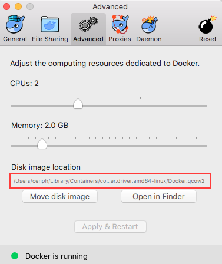
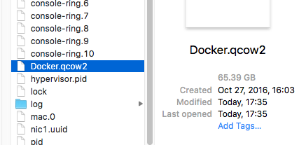

### docker on mac

**`no space left on device` error**

- check `~/Library/Containers/com.docker.docker/Data/com.docker.driver.amd64-linux/Docker.qcow2`.

- default max size is `64GB`, so remove useless images/containers will fix it.

